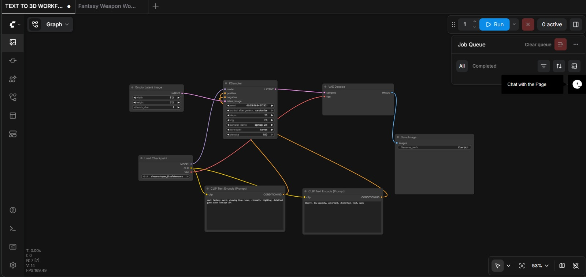

# Text→Image Workflow — Step-by-step

This file explains how to recreate the Text→Image workflow shown in the screenshot and where to place the workflow screenshot in the package.

Screenshot
- Place your screenshot image at `assets/workflow_screenshot.png`, `assets/workflow_screenshot.jpg`, or `assets/workflow_screenshot.jpeg` to have it shown inline here. After you upload it, GitHub will display it in this file.

<!-- Supported image formats: .png, .jpg, .jpeg -->

Note: GitHub will display `assets/workflow_screenshot.png`, `assets/workflow_screenshot.jpg`, or `assets/workflow_screenshot.jpeg`. Save your screenshot with any of those names and the file will render here.

Overview
- This workflow builds a latent-space image using an empty latent input, conditions it with two CLIP prompts (positive and negative), runs a sampler (KSampler), decodes with a VAE, and saves the result.

Nodes and settings (create these nodes in the ComfyUI graph):

1. Empty Latent Image
   - Purpose: seed an empty latent tensor of the target resolution.
   - Settings: `width` = 512, `height` = 512, `batch_size` = 1 (adjust as needed).
   - Output port: `LATENT`

2. Load Checkpoint
   - Purpose: select the Stable Diffusion checkpoint (safetensors / ckpt).
   - Select your model file (e.g., `dreamshaper_8.safetensors`).
   - Output ports: `MODEL`, `CLIP`, `VAE` (some models include VAE and clip references).

3. CLIP Text Encode (Prompt) — Positive (Prompt)
   - Purpose: encode the positive prompt (what you want to see).
   - Example prompt (from screenshot):
     "dark fantasy sword, glowing blue runes, cinematic lighting, detailed game asset concept art"
   - Output port: `CONDITIONING` (send to sampler positive input).

4. CLIP Text Encode (Prompt) — Negative (Prompt)
   - Purpose: encode the negative/avoid list.
   - Example negative prompt (from screenshot):
     "blurry, low quality, watermark, distorted, text, ugly"
   - Output port: `CONDITIONING` (send to sampler negative input).

5. KSampler
   - Purpose: run the diffusion sampling process in latent space.
   - Important inputs (connect from nodes above):
     - `model` <- `Load Checkpoint.MODEL`
     - `positive` <- `CLIP Text Encode (positive).CONDITIONING`
     - `negative` <- `CLIP Text Encode (negative).CONDITIONING`
     - `latent_image` <- `Empty Latent Image.LATENT`
   - Typical parameters (as in screenshot):
     - `seed`: random or specific integer
     - `steps`: 20
     - `cfg` (classifier-free guidance scale): 7.0
     - `sampler_name`: `dpmpp_2m` (or your preferred sampler)
     - `scheduler`: `karras`
     - `denoise`: 1.0
   - Output port: `LATENT` (samples in latent space)

6. VAE Decode
   - Purpose: decode the latent-space samples into an image.
   - Input: `samples` <- `KSampler.LATENT`
   - If your checkpoint provides a VAE via `Load Checkpoint.VAE`, the node may auto-select it or let you choose.
   - Output port: `IMAGE`

7. Save Image
   - Purpose: write the decoded image to disk and register it in the UI.
   - Input: `images` <- `VAE Decode.IMAGE`
   - Optionally set `filename_prefix` or output folder.

Connections summary (explicit):
- `Empty Latent Image.LATENT` -> `KSampler.latent_image`
- `Load Checkpoint.MODEL` -> `KSampler.model`
- `CLIP Text Encode (positive).CONDITIONING` -> `KSampler.positive`
- `CLIP Text Encode (negative).CONDITIONING` -> `KSampler.negative`
- `KSampler.LATENT` -> `VAE Decode.samples`
- `VAE Decode.IMAGE` -> `Save Image.images`

Running the workflow
1. Start ComfyUI and open the web UI at `http://localhost:8188`.
2. Create the nodes listed above and connect them exactly as in the connections summary.
3. Set the prompts and sampler parameters, then press `Run` (or `Ctrl+Enter`).
4. Monitor the Job Queue and preview area. Results will be saved to the output folder.

Tips and variations
- Hires / two-pass: for higher-resolution outputs, use a two-pass or Hires-Fix workflow (available in blueprints).
- ControlNet / Image-conditioning: you can insert additional conditioning nodes into the sampler inputs for image-to-image or ControlNet-guided workflows.
- Saving as blueprint: after you build and test the graph, save the graph as a blueprint from the UI for reuse (File → Save Workflow or drag the generated PNG to get workflow embed).

Including your actual screenshot
- To include the screenshot you attached, upload it to `assets/workflow_screenshot.png`, `assets/workflow_screenshot.jpg`, or `assets/workflow_screenshot.jpeg` inside the package. The Markdown at the top will display it automatically on GitHub.

Would you like me to also: 
- export a ready-to-load blueprint JSON that you can import into ComfyUI, or
- add a preset blueprint file into `ComfyUI/blueprints` so it appears in the UI's blueprint list?
